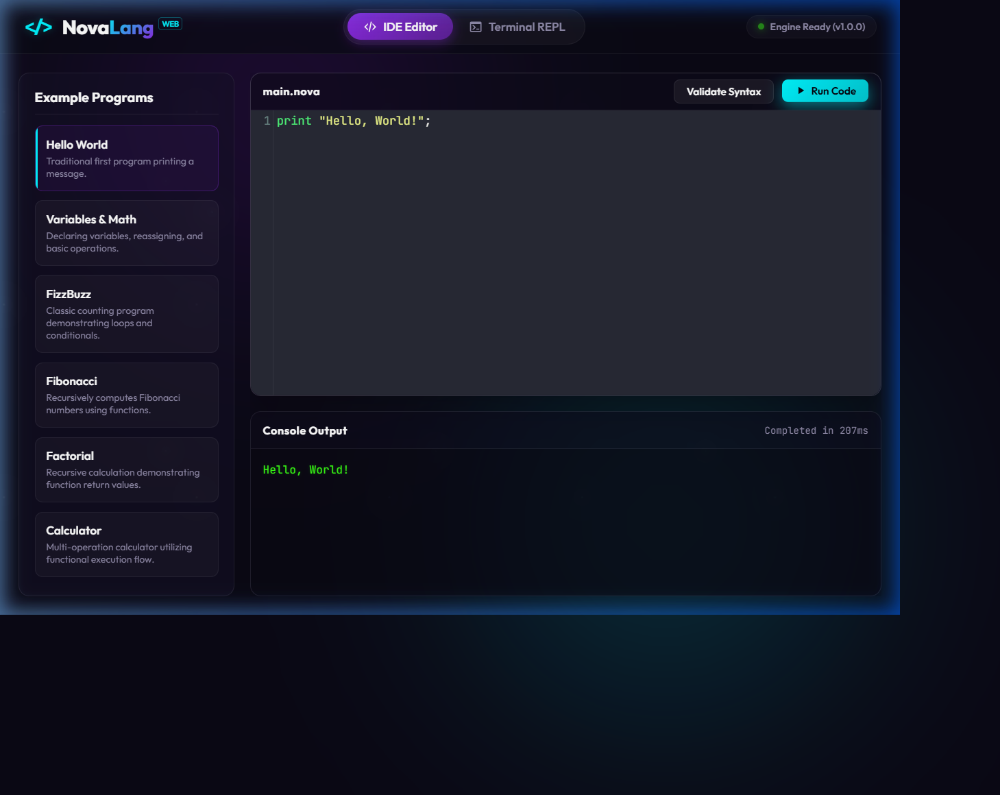
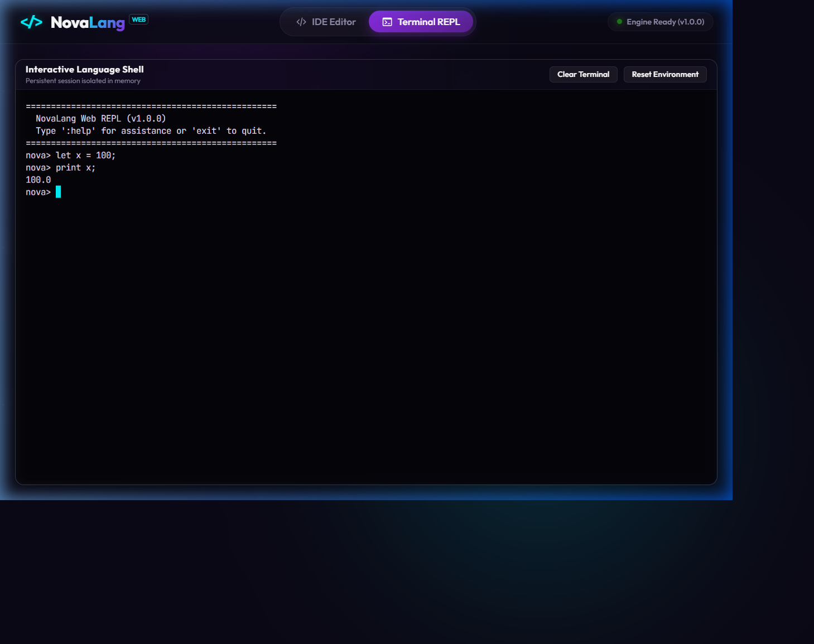

# NovaLang Web — Online Interpreter

🔗 **Live Demo:** [https://novalang-web.onrender.com](https://novalang-web.onrender.com)

A full-stack web application that lets anyone write and run code in NovaLang — a custom interpreted programming language built from scratch in Java — directly in the browser. No installation required.

> ⚠️ **Note on Free Hosting:** This live demo is hosted on a free Render web service. If the app has been inactive, it may take 30-60 seconds to spin up on the first request.

## Screenshots




## Features
- **Online IDE** with a syntax-aware editor (CodeMirror) and instant Run capability.
- **Live Terminal REPL** with persistent session state maintained isolated in-memory.
- **6 Built-in Example Programs** (Hello World, FizzBuzz, Fibonacci, etc.) accessible with a single click.
- **Execution Timeout Protection** (5-second hard limit) to prevent system hangs on infinite loops.
- **Fully Responsive Layout** designed with custom CSS (Glassmorphism & Neon theme) that stacks cleanly on mobile viewports.

## Tech Stack

| Layer | Technology | Version | Notes |
|---|---|---|---|
| Language | Java | 13.0.2 | Standard Java 13 source compliance |
| Backend | Spring Boot | 2.7.18 | Robust REST APIs and WebSocket server |
| Realtime | Spring WebSocket | bundled | Manages stateful live REPL socket sessions |
| Frontend | Vanilla HTML5 + CSS3 + JS | — | Responsive interface with no external framework overhead |
| Code Editor | CodeMirror | 5.65.16 | Lightweight syntax-highlighted editor via CDN |
| Terminal | xterm.js | 4.19.0 | High-performance terminal emulator via CDN |
| Container | Docker | — | Base image `eclipse-temurin:13-jdk-alpine` |

## Architecture
```
[Browser Client] 
   │
   ├─── REST (/api/execute) ────────► [Spring REST Controller] ──► [NovaLang Service] ─► [Lexer ➔ Parser ➔ Evaluator]
   │
   └─── WebSockets (/ws/repl) ──────► [WebSocket Handler] ──────► [ReplSession (Stateful Env)] ─► [Lexer ➔ Parser ➔ Evaluator]
```

## Running Locally

To build and run the application locally, execute:

```bash
mvn clean package
java -jar target/novalang-web-1.0.0.jar
# open http://localhost:8085
```

*Note: For local environments, the server is configured to run on port `8085` to avoid common database port conflicts.*

## NovaLang Language Quick Reference

For complete grammar, type semantics, and keyword list, see [LANGUAGE_SPEC.md](LANGUAGE_SPEC.md).

### Examples:
```python
# Variable declarations & calculations
let x = 10;
let y = 20;
print x + y;

# Custom functions with closure scope
fn multiplier(factor) {
  return fn(number) {
    return number * factor;
  };
}
let double = multiplier(2);
print double(5); # prints 10.0
```

## Project Structure

```
NovaLangWeb/
├── .github/
│   └── workflows/
│       └── build.yml
├── src/
│   ├── main/
│   │   ├── java/com/novalang/
│   │   │   ├── NovaLangApplication.java
│   │   │   ├── config/
│   │   │   │   └── WebSocketConfig.java
│   │   │   ├── controller/
│   │   │   │   ├── ExecuteController.java
│   │   │   │   ├── GlobalExceptionHandler.java
│   │   │   │   └── ReplWebSocketHandler.java
│   │   │   ├── evaluator/
│   │   │   │   ├── Environment.java
│   │   │   │   ├── Evaluator.java
│   │   │   │   ├── NovaFunction.java
│   │   │   │   └── ReturnException.java
│   │   │   ├── exception/
│   │   │   │   ├── LexerException.java
│   │   │   │   └── ParseException.java
│   │   │   ├── lexer/
│   │   │   │   ├── Lexer.java
│   │   │   │   └── Token.java
│   │   │   ├── model/
│   │   │   │   ├── ExecuteRequest.java
│   │   │   │   ├── ExecuteResponse.java
│   │   │   │   └── ReplSession.java
│   │   │   ├── parser/
│   │   │   │   ├── Parser.java
│   │   │   │   └── nodes/
│   │   │   │       └── ... AST Nodes ...
│   │   │   └── service/
│   │   │       └── NovaLangService.java
│   │   └── resources/
│   │       ├── application.properties
│   │       ├── application-prod.properties
│   │       └── static/
│   │           ├── index.html
│   │           ├── css/
│   │           │   └── style.css
│   │           └── js/
│   │               ├── app.js
│   │               ├── ide.js
│   │               └── repl.js
│   └── test/
│       └── java/com/novalang/
│           ├── ExecuteControllerTest.java
│           └── NovaLangServiceTest.java
├── screenshots/
│   ├── ide-tab.png
│   ├── repl-tab.png
│   └── mobile-view.png
├── .gitignore
├── Dockerfile
├── render.yaml
├── LICENSE
├── LANGUAGE_SPEC.md
├── README.md
└── pom.xml
```

## What I Learned Building This
Building NovaLang Web provided hands-on experience bridging compiler engineering concepts (lexing, parsing, stateful closure scoping) with modern full-stack web service architectures. It highlighted the challenges of managing live, interactive connections using WebSockets while maintaining strict memory and security boundaries, such as thread isolation, automatic REPL cleanup, and loop execution timeouts.

## License
MIT
